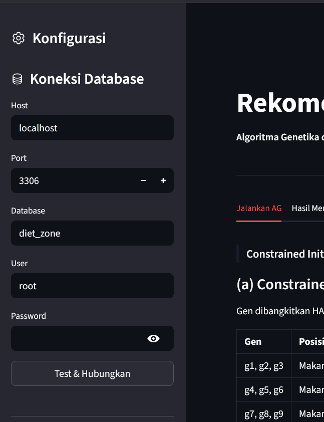

# Sistem Rekomendasi Menu Diet Zone menggunakan Algoritma Genetika dengan Knowledge-Based Constraint

**By Kelompok 4 Kelas A**

---

## 📌 Deskripsi Sistem Singkat
Website ini merupakan implementasi dari sistem cerdas untuk memberikan rekomendasi menu makanan harian berdasarkan aturan gizi **Diet Zone** (Karbohidrat 40%, Protein 30%, Lemak 30%, dan Serat ≥8,33g/waktu makan). Sistem ini menggunakan **Algoritma Genetika (AG)** yang dioptimasi menggunakan **Knowledge-Based Constraint (KB-AG)** untuk memastikan bahwa bahan makanan yang direkomendasikan selalu sesuai dengan waktu makannya (Pagi, Siang, Malam). 

Sistem memecahkan masalah pencarian acak pada AG standar melalui dua pendekatan utama:
1. **Constrained Initialization:** Gen dibangkitkan secara terarah dari himpunan (pool) waktu makan yang valid.
2. **Directed Mutation:** Gen yang bermutasi hanya akan diganti dengan bahan makanan dari *pool* waktu makan yang sama.

---

## 📂 Struktur Proyek dan Penjelasan File

Berdasarkan struktur folder proyek `diet_zone`, berikut adalah rincian dan fungsi dari setiap direktori dan file:

*   **`diet_zone/`** (Direktori Utama Proyek)
    *   **`scraping/`** (Direktori Modul Scraping & Pra-pemrosesan Data)
        *   **`knowledge_base_waktu_makan.md`**: File dokumentasi (*markdown*) yang mencatat aturan atau *knowledge base* pengelompokan bahan makanan berdasarkan waktu konsumsinya (pagi, siang, malam).
        *   **`requirements.txt`**: File teks berisi daftar *library* Python yang secara khusus dibutuhkan hanya untuk menjalankan proses *scraping* (seperti `requests`, `beautifulsoup4`, dll).
        *   **`tkpi_diet_zone.csv`**: File dataset akhir (*clean data*) hasil pemrosesan. Berisi data bahan makanan beserta rasio makronutrien yang sudah disesuaikan persentasenya untuk kebutuhan kalkulasi Algoritma Genetika dalam sistem Diet Zone.
        *   **`tkpi_raw.csv`**: File dataset mentah yang memuat Tabel Komposisi Pangan Indonesia (TKPI) sebelum dibersihkan atau diproses lebih lanjut.
        *   **`tkpi.py`**: *Script* utama Python untuk mengeksekusi proses pengumpulan data (jika ada *scraping* web) atau proses normalisasi dari `tkpi_raw.csv` menjadi `tkpi_diet_zone.csv`.
    *   **`.gitignore`**
        *   File konfigurasi Git yang mendaftar file atau folder mana saja (seperti `__pycache__` atau *environment* lokal) yang tidak boleh dilacak atau diunggah ke repositori GitHub.
    *   **`app.py`**
        *   File *entry point* (utama) untuk menjalankan antarmuka (*User Interface*) aplikasi berbasis web menggunakan Streamlit. File ini mengatur tampilan halaman, navigasi tab, pemanggilan komponen visual, dan *session state*.
    *   **`db_connector.py`**
        *   Modul Python yang berfungsi sebagai jembatan atau *driver* untuk mengelola koneksi dari aplikasi ke database MySQL. File ini berisi fungsi-fungsi untuk `test_connection()`, mengambil *pool* data, dan membaca parameter dari database.
    *   **`diet_zone.sql`**
        *   File *dump* database SQL. File ini harus di-*import* ke MySQL lokal Anda. Di dalamnya terdapat struktur tabel dan kumpulan data bahan makanan beserta nilai gizinya yang akan digunakan oleh aplikasi.
    *   **`evaluation.py`**
        *   Modul Python yang menyimpan seluruh logika bisnis khusus untuk melakukan evaluasi komparatif. Di dalamnya terdapat fungsi untuk menjalankan simulasi beberapa *run*, membandingkan KB-AG dengan AG Standar, dan menghasilkan metrik komparasi (baik matematis maupun praktis).
    *   **`genetic_algorithm.py`**
        *   Modul inti (otak dari sistem) yang mendefinisikan kelas dan fungsi untuk Algoritma Genetika. Berisi logika mengenai representasi kromosom, inisialisasi populasi (*Constrained Initialization*), perhitungan *fitness*, proses *crossover*, proses mutasi (*Directed Mutation*), dan verifikasi *hard constraint*.
    *   **`index.py`**
        *   File Python alternatif yang biasanya digunakan untuk pengujian (*testing*) logika program via CLI (Command Line Interface) tanpa harus menjalankan antarmuka Streamlit.
    *   **`requirements.txt`** (Root)
        *   File berisi daftar dependensi dan *library* utama (seperti `streamlit`, `pandas`, `mysql-connector-python`, dll) yang harus diinstal agar aplikasi inti Streamlit dapat berjalan dengan sempurna.

---

## 🛠️ Panduan Penggunaan Sistem

Sebelum menjalankan salah satu dari *use case* di bawah ini, pastikan Anda telah menyalin (*clone*) repositori ini ke komputer lokal Anda dan masuk ke dalam direktori proyek.

**Langkah Persiapan (Clone Repository):**
1. Buka terminal atau *command prompt* di komputer Anda.
2. Jalankan perintah berikut untuk mengunduh repositori:
   ```bash
   git clone [https://github.com/juliarta99/diet_zone.git](https://github.com/juliarta99/diet_zone.git)

### Case 1: Scraping & Persiapan Data (Opsional)
Tahap ini digunakan jika Anda ingin melakukan *scraping* atau pemrosesan ulang terhadap data Tabel Komposisi Pangan Indonesia (TKPI).

1. Buka terminal dan arahkan ke dalam direktori `scraping`:
   ```bash
   cd scraping

```

2. Install *dependencies* khusus untuk proses *scraping*:
```bash
pip install -r requirements.txt

```


3. Jalankan *script* pemrosesan data:
```bash
python tkpi.py

```


4. **Hasil Eksekusi:** *Script* akan memproses `tkpi_raw.csv` dan menghasilkan dataset baru bernama `tkpi_diet_zone.csv`.

### Case 2: Menjalankan Aplikasi Streamlit Utama

Ini adalah panduan untuk menjalankan *User Interface* sistem rekomendasi.

**1. Instalasi dan Persiapan Database**

1. Pastikan terminal berada di direktori *root* (utama) proyek.
2. Install semua *requirements* aplikasi:
```bash
pip install -r requirements.txt

```


3. Buka aplikasi database lokal Anda (XAMPP / MySQL / MariaDB).
4. Buat database baru dengan nama `diet_zone`.
5. Import file `diet_zone.sql` yang berada di direktori *root* ke dalam database tersebut.

**2. Menjalankan Server Lokal**
Jalankan aplikasi Streamlit dengan perintah berikut:

```bash
streamlit run app.py --server.port 8501

```

Aplikasi sekarang dapat diakses melalui browser Anda di alamat: **`http://localhost:8501`**

---

## 📖 Alur Kerja dan Fitur Antarmuka (UI)

### A. Sidebar (Kiri): Koneksi Database & Konfigurasi Parameter

1. **Koneksi Database:**
* Masukkan detail database lokal Anda (Host, Port, Database, User, Password).
* Klik tombol **"Test & Hubungkan"**. Jika berhasil, sistem akan memuat *Knowledge Base* yang memisahkan data makanan menjadi *pool* Pagi, Siang, dan Malam.
* *Space Tampilan Antarmuka Database:*
> 


2. **Parameter Algoritma:**
* Atur nilai seperti Ukuran Populasi, Jumlah Generasi, *Crossover Rate*, dan *Mutation Rate*.


### B. Menu Utama (Tab Navigasi)

#### 1. Tab "Jalankan AG"

* Menjelaskan mekanisme *Constrained Initialization* dan *Directed Mutation*.
* Klik tombol **"▶ Jalankan Algoritma Genetika"** untuk memulai pencarian solusi optimal. Grafik iterasi *fitness* akan muncul secara *real-time*.
* *Space Tampilan Antarmuka Tab 1:*
> ``


#### 2. Tab "Hasil Menu X Hari"

* Menampilkan saran menu (Pagi, Siang, Malam) terbaik yang berhasil ditemukan.
* Menyajikan perbandingan metrik kalori dan makronutrien dengan target persentase Diet Zone beserta ukuran kedekatannya (*Euclidean Distance*).
* *Space Tampilan Antarmuka Tab 2:*
> ``


#### 3. Tab "Analisis Fitness"

* Memvisualisasikan pergerakan Kurva Konvergensi (Fitness Terbaik vs Fitness Rata-rata).
* Menyajikan ringkasan nilai komputasi tiap harinya untuk evaluasi perbandingan nilai.
* *Space Tampilan Antarmuka Tab 3:*
> ``


#### 4. Tab "Verifikasi Constraint"

* Modul pengecekan otomatis (audit sistem) untuk memastikan tidak ada gen makanan yang ditempatkan pada waktu makan yang salah (contoh: menu sarapan tidak boleh ditempatkan di jadwal makan malam). Validasi 100% menandakan algoritma KB-AG bekerja dengan benar.
* *Space Tampilan Antarmuka Tab 4:*
> ``


#### 5. Tab "Evaluasi"

* Menu *dashboard* perbandingan performa antara **Knowledge-Based AG (KB-AG)** vs **AG Standar**.
* Klik tombol eksekusi untuk menjalankan N jumlah pengujian.
* Hasilnya mencakup kesimpulan evaluasi matematis (rata-rata selisih jarak target gizi) dan evaluasi praktis (persentase gen yang valid sesuai aturan waktu makannya).
* *Space Tampilan Antarmuka Tab 5:*
> ``